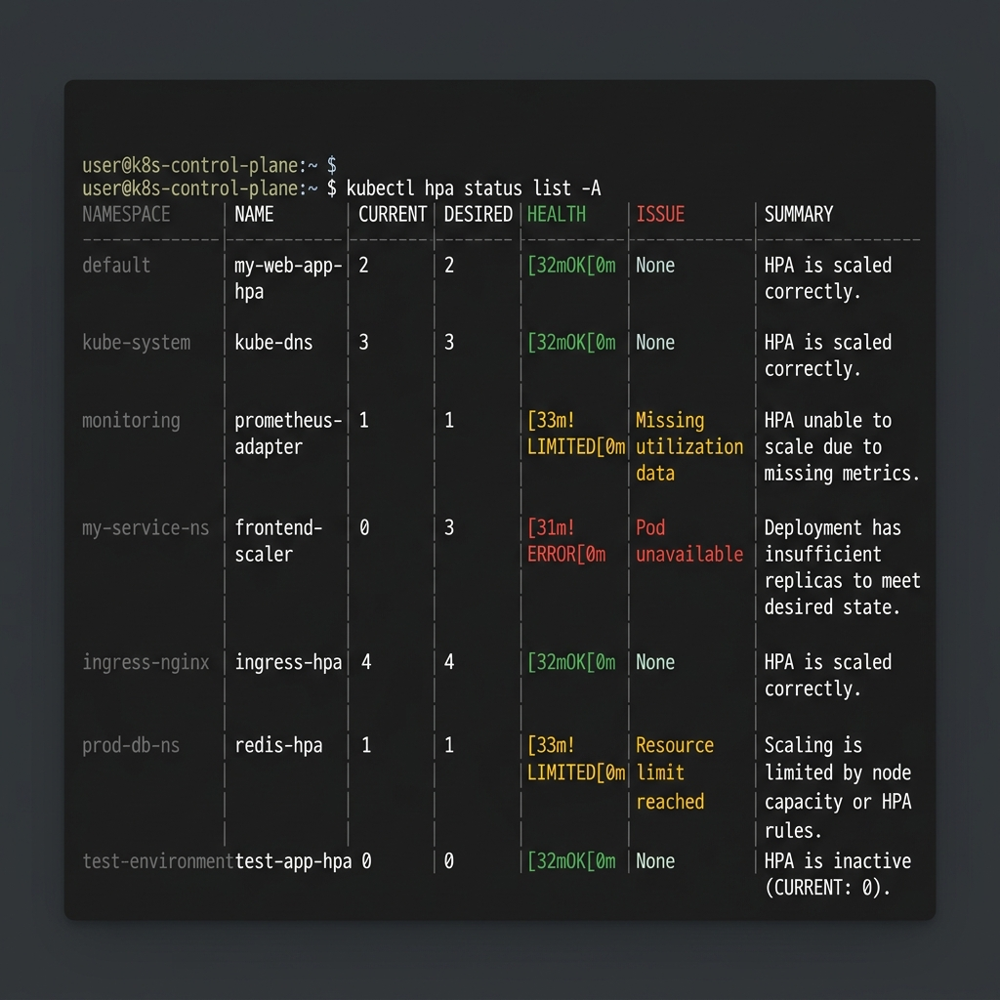

# kubectl-hpa-status

[](https://github.com/mattsu2020/kubectl-hpa-status/actions/workflows/ci.yml)
[](https://github.com/mattsu2020/kubectl-hpa-status/actions/workflows/codeql.yml)
[](https://github.com/mattsu2020/kubectl-hpa-status/actions/workflows/release.yml)
[](https://pkg.go.dev/github.com/mattsu2020/kubectl-hpa-status)
[](https://goreportcard.com/report/github.com/mattsu2020/kubectl-hpa-status)
[](https://github.com/mattsu2020/kubectl-hpa-status/stargazers)
[](https://github.com/mattsu2020/kubectl-hpa-status/releases)
[](https://goreleaser.com/)
[](https://golangci-lint.run/)
[](https://krew.sigs.k8s.io/plugins/)
[](https://kubernetes.io/docs/tasks/run-application/horizontal-pod-autoscale/)
[](https://codecov.io/gh/mattsu2020/kubectl-hpa-status)
[](LICENSE)



A kubectl plugin for investigating HorizontalPodAutoscaler (HPA) status using existing Kubernetes API signals, with detailed scaling analysis.

Japanese README: [README.ja.md](README.ja.md)

> **Note**: When installed via Krew, use `kubectl hpa_status` (underscore form). This README shows `kubectl hpa status` as the primary form; if it doesn't work, replace with `kubectl hpa_status`.

This tool quickly answers three common HPA operations questions:

- Is this HPA healthy, capped at limits, in stabilization, or failing to read metrics?
- Which condition or metric best explains the current behavior?
- What command should I run next, and can I safely dry-run it?

## Before / After

<table>
<tr>
<th>Before: raw <code>kubectl describe hpa</code></th>
<th>After: <code>kubectl hpa status --explain</code></th>
</tr>
<tr>
<td>
<pre><code>Name: web
Namespace: production
Metrics: cpu: 92% / 60%
Min replicas: 2
Max replicas: 10
Deployment pods: 10 current / 10 desired
Conditions:
  AbleToScale=True
  ScalingActive=True
  ScalingLimited=True
Events:
  SuccessfulRescale New size: 10</code></pre>
</td>
<td>
<pre><code>web production
Summary: limited at maxReplicas
Replicas: 10 current / 10 desired
CPU: 92% / 60% target

Interpretation:
- HPA wants more replicas, but maxReplicas=10 caps it.
- ScalingActive=True, so metrics are available.

Recommended actions:
- Check capacity, then raise maxReplicas with --suggest.</code></pre>
</td>
</tr>
</table>

## Demo


| Workflow | Visual | Recording |
| --- | --- | --- |
| `status --explain` | [status-explain.svg](images/status-explain.svg) | [cast](docs/status-explain.cast) |
| `doctor` full diagnostics | [doctor.svg](images/doctor.svg) | [cast](docs/doctor.cast) |
| `list -A --wide --problem` | [list-wide.svg](images/list-wide.svg) | [cast](docs/list-wide.cast) |
| `scan` cluster triage | [scan-demo.svg](images/scan-demo.svg) | [cast](docs/scan.cast) |
| `timeline --since=30m` | [timeline.svg](images/timeline.svg) | [cast](docs/timeline.cast) |
| `recommend` best practice audit | [recommend.svg](images/recommend.svg) | [cast](docs/recommend.cast) |
| `--simulate-metric` what-if | [simulate.svg](images/simulate.svg) | [cast](docs/simulate.cast) |
| TUI interactive dashboard | [tui.svg](images/tui.svg) | [cast](docs/tui.cast) |
| `watch --interval 5s` | [watch-mode.svg](images/watch-mode.svg) | [cast](docs/watch.cast) |
| `--suggest` → `--fix --apply` | [apply-diff.svg](images/apply-diff.svg) | [cast](docs/fix-flow.cast) |
| Japanese labels (`--lang=ja`) | [ja-output.svg](images/ja-output.svg) | |
| JSON output | [json-output.svg](images/json-output.svg) | |
| Metrics failure | [metrics-failure.svg](images/metrics-failure.svg) | |
| Scale-down stabilization | [stabilized-output.svg](images/stabilized-output.svg) | |
| Multi-metric estimation | [multi-metric-output.svg](images/multi-metric-output.svg) | |

## Install

### Krew (recommended)

```sh
kubectl krew install hpa-status
```

```sh
kubectl hpa_status status <hpa-name> -n <namespace>
kubectl hpa_status list -A --wide
kubectl hpa_status <hpa-name> --suggest
```

Krew registers the plugin as `hpa-status`, discovered via `kubectl hpa_status` (underscore form). This README uses `kubectl hpa status` as the recommended form where supported. If it doesn't work, use `kubectl hpa_status status <hpa-name>` or `kubectl-hpa-status status <hpa-name>`.

### Homebrew

```sh
brew install mattsu2020/kubectl-hpa-status/kubectl-hpa-status
kubectl-hpa-status list -A --wide
```

### Manual install

```sh
go build -o kubectl-hpa-status .
sudo mv ./kubectl-hpa-status /usr/local/bin/
kubectl hpa status <hpa-name> -n <namespace>
```

For RBAC permissions, see [docs/rbac.yaml](docs/rbac.yaml).

### Requirements

- **Kubernetes 1.26+** (`autoscaling/v2` stable API)
- kubectl configured with a kubeconfig
- metrics-server (for CPU/memory metrics) or a custom/external metrics adapter

## Representative Commands

```sh
# 1. Detailed status with interpretation and next steps
kubectl hpa_status status <hpa> -n <ns> --explain

# 2. Full diagnostics for a failing HPA
kubectl hpa_status doctor <hpa> -n <ns>

# 3. List all problematic HPAs across the cluster
kubectl hpa_status list -A --problem

# 4. Show concrete fix suggestions as kubectl patch commands
kubectl hpa_status status <hpa> --suggest

# 5. Cluster-wide scan for HPA issues
kubectl hpa_status scan
```

## Examples

Practical sample manifests are in [examples/](examples/).

```sh
kubectl apply -f examples/cpu-memory-hpa.yaml
kubectl hpa status web-multi -n hpa-status-examples --explain --suggest
kubectl hpa status list -n hpa-status-examples --wide
```

## Documentation

| Document | Content |
| --- | --- |
| [Usage Guide](docs/usage.md) | Flag reference, config file, health score, TUI key bindings, JSONPath examples |
| [Reference](docs/reference.md) | Doctor command, safe fix flow, multi-metric trace, simulator, auditor, timeline, troubleshooting, roadmap |
| [Troubleshooting](docs/troubleshooting.md) | Symptom/command table and FAQ |

## Development

```sh
make build
make test
make coverage
make lint
```

- [ARCHITECTURE.md](ARCHITECTURE.md)
- [SECURITY.md](SECURITY.md)
- [CONTRIBUTING.md](CONTRIBUTING.md)

## License

Apache-2.0
